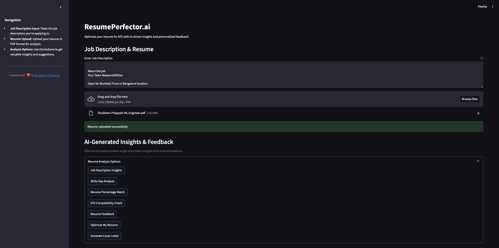

# ResumePerfector.ai

## About The Project

**ResumePerfector.ai** is an GENAI-powered platform designed to optimize resumes for applicant tracking systems (ATS). By leveraging the **Google Gemini LLM Model**, the system enhances the likelihood of your resume passing through ATS filters and matching specific job descriptions. 

### Key Features:
- **Job Description Insights**: Analyzes job descriptions and provides insights to improve your resume alignment.
- **Resume Percentage Match**: Compares your resume against the job description and provides a match percentage.
- **Skills Gap Analysis**: Identifies missing skills in your resume based on the job description.
- **Resume Feedback**: Provides actionable feedback to improve your resume's effectiveness.
- **ATS Compatibility Check**: Tests how well your resume is likely to perform with ATS systems.
- **Optimize My Resume**: Provides suggestions to improve your resume's structure, language, and keywords.
- **Automated Cover Letter Generation**: Generates a personalized cover letter based on the job description.

## Screenshot



<!-- ## Demo

You can view the demo of ResumePerfector.ai [here](https://vimeo.com/1042608166).

## Social Media

You can check out more about the project on LinkedIn: [ResumePerfector LinkedIn Post](https://www.linkedin.com/posts/shubhamprajapati7748_ai-stockbotx-agenticai-activity-7278757239966867456-pVSh/) -->

## Table of Contents

- [Prerequisites](#prerequisites)
- [Getting Started](#getting-started)
- [Contributing](#contributing)
- [License](#license)
- [Contact](#contact)
- [Acknowledgements](#acknowledgements)

### Prerequisites

Before getting started, make sure you have the following:

- **GOOGLE GEMINI API Key**: You’ll need an API key for interaction with the Google Gemini LLM.

### Getting Started

To get started with this project locally, you’ll need Python 3.10+ installed on your machine along with the necessary Python packages. You can either clone the repository and install dependencies manually or use Docker for an isolated environment.

## Installation Steps

1. **Clone the repository**:
   - Open your terminal or command prompt.
   - Navigate to the directory where you want to install the project.
   - Run the following command to clone the GitHub repository:
     ```bash
     git clone https://github.com/shubhamprajapati7748/resume-perfector.ai
     ```

2. **Create a Virtual Environment (Optional)**:
   - It's recommended to use a virtual environment to manage dependencies. Run the following command:
     ```bash
     conda create -p <Environment_Name> python==<python version> -y
     ```

3. **Activate the Virtual Environment (Optional)**:
   - Activate the virtual environment based on your operating system:
     ```bash
     conda activate <Environment_Name>/
     ```

4. **Install Dependencies**:
   - Navigate to the project directory:
     ```bash
     cd [project_directory]
     ```
   - Run the following command to install project dependencies:
     ```bash
     pip install -r requirements.txt
     ```

5. **Create `.env` file and add your API keys**:
   - Create a `.env` file in the root directory and add your Google Gemini API key for LLM interaction.

6. **Run the Project**:
   - To start the application, run the following command:
     ```bash
     streamlit run app.py
     ```

7. **Access the Project**:
   - Visit `http://localhost:8501` in your browser to use the app.


## Contributing

Contributions to the Google Gemini-Pro Chat Application are welcome! If you have suggestions, enhancements, or bug fixes, please follow the steps below:

1. Fork the project.
2. Create your feature branch (`git checkout -b feature/YourFeature`).
3. Commit your changes (`git commit -m 'Add some feature'`).
4. Push to the branch (`git push origin feature/YourFeature`).
5. Open a pull request.

## License

Distributed under the MIT License. See `LICENSE.txt` for more information.

## Contact

- Shubham Prajapati - [shubhamprajapati7748@gmail.com](mailto:shubhamprajapati7748@gmail.com)

## Acknowledgement

- **Google Gemini** for providing LLM to process the user requests and generate the response in this project.